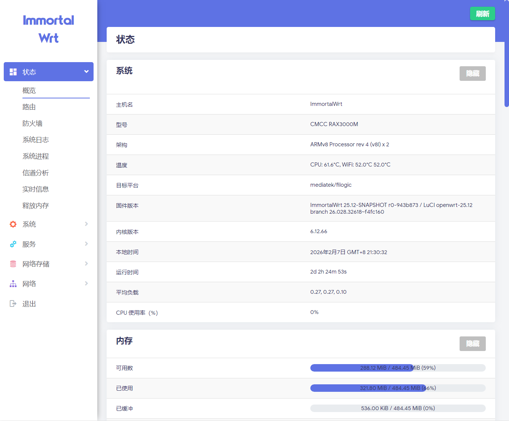
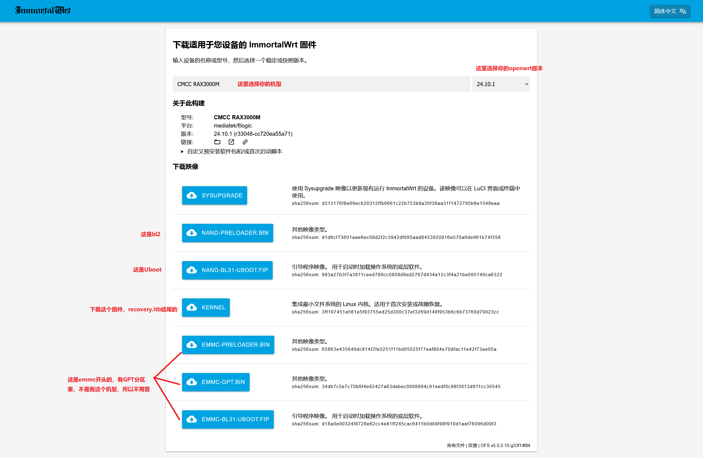

## License

[MIT](https://github.com/P3TERX/Actions-OpenWrt/blob/main/LICENSE) © [**P3TERX**](https://p3terx.com)   
[**作者源仓库 Actions-OpenWrt**](https://github.com/P3TERX/Actions-OpenWrt)

# 仅供学习、查阅资料使用。
**目前采用overlay分区编译，非必要 不要编译太多插件，我都想使用 精简版配置文件** 
.github/workflows_  工作流文件（自动化编译最主要的文件），如果无法编译可以看描述文件内容自己更改 
configs_____________ 配置文件夹（主要修改这个），Target-* 修改平台型号。Packages-* 是插件编译。 
files/etc____________ 固件内置配置文件夹，用于覆盖使用（一般不会改，我只是用来预先放smartdns配置文件） 
patches_____________我自己放的补丁文件夹，现在基本用不上了（天灵大佬已经把问题解决） 
scripts______________ 脚本文件夹，添加 插件克隆 和 实现想要的操作 

目前openwrt-25.12分支还存在编译时间过长的问题，部分平台先不切换
## ip地址：192.168.8.1 
**运行编译时间：周一 Allwinner、周二 mt7621、周三 Rockchip、周四 mtk_filogic、周五 X86-64** 
smartdns（海外端口6553） Openclash已下载好clash?内核 

 
 

## 如何使用呢？ 

**X86** 平台：应该不用教了吧，写在U盘也行，硬盘也行。 

**Allwinner、Rockchip** 平台：能插内存卡的可以写内存卡，emmc的就自己找官方工具写入 

**mt7621** 应该也不难，先刷好不死然后刷 -factory.bin 后面再刷 -squashfs-sysupgrade.bin 就可以 

**MTK-filogic** 平台最麻烦 
先科普一下（*建议参考其他教程刷！需要按顺序刷入！*） 
**-gpt.bin** 有些存储空间比较大的机型会有这个文件，不多（*有的话第一次也要刷* ） 
**-preloader.bin** 是 **bl2** （op官方需要..所以第一次刷必须！） 
**-bl31-uboot.fip** 是 **uboot** （不刷你也刷不了这个固件！）*后续想刷回lede的固件可以用ttl先把这个刷了，Uboot就改它需要的文件名..就是 -fip.bin 文件改 -bl31-uboot.fip文件..* 
**-recovery.itb** 这是uboot自动识别刷入的 第一个初始固件（这里推荐使用天灵大佬的初始固件，下面网址），刷了以后开机进去的时候会提示让你刷 -squashfs-sysupgrade.itb 结尾的固件（这个就可以刷本仓库编译出来带 squashfs 的固件） 

[ImortalWrt Firmware Selector](https://firmware-selector.immortalwrt.org/)
这是天灵大佬的自动生成固件网站 

例如我的设备CMCC RAX3000M nand版本

如果你本来是有192.168.1.1后台的uboot了（能刷lede固件的）如何切换到这个固件呢？ 
192.168.1.1/bl2.html 
192.168.1.1/uboot.html 
根据上面提示自己领悟..完毕。 
 
**English** | [中文](https://p3terx.com/archives/build-openwrt-with-github-actions.html)

# Actions-OpenWrt

A template for building OpenWrt with GitHub Actions

## Credits

- [Microsoft Azure](https://azure.microsoft.com)
- [GitHub Actions](https://github.com/features/actions)
- [OpenWrt](https://github.com/openwrt/openwrt)
- [Lean's OpenWrt](https://github.com/coolsnowwolf/lede)
- [tmate](https://github.com/tmate-io/tmate)
- [mxschmitt/action-tmate](https://github.com/mxschmitt/action-tmate)
- [csexton/debugger-action](https://github.com/csexton/debugger-action)
- [Cowtransfer](https://cowtransfer.com)
- [WeTransfer](https://wetransfer.com/)
- [Mikubill/transfer](https://github.com/Mikubill/transfer)
- [actions/upload-artifact](https://github.com/actions/upload-artifact)
- [softprops/action-gh-release](https://github.com/softprops/action-gh-release)
- [Mattraks/delete-workflow-runs](https://github.com/Mattraks/delete-workflow-runs)
- [dev-drprasad/delete-older-releases](https://github.com/dev-drprasad/delete-older-releases)
- [peter-evans/repository-dispatch](https://github.com/peter-evans/repository-dispatch)

#### Related Repositories（部分代码灵感来源，感谢~）

- [VIKINGYFY/OpenWRT-CI](https://github.com/VIKINGYFY/OpenWRT-CI)
- [smallprogram/OpenWrtAction](https://github.com/smallprogram/OpenWrtAction)
- [zzcabc/OpenWrt_Action](https://github.com/zzcabc/OpenWrt_Action)
- [WYC-2020/Actions-OpenWrt](https://github.com/WYC-2020/Actions-OpenWrt)
- [mingxiaoyu/R1-Plus-LTS](https://github.com/mingxiaoyu/R1-Plus-LTS)
- [SuLingGG/OpenWrt-Rpi](https://github.com/SuLingGG/OpenWrt-Rpi)

